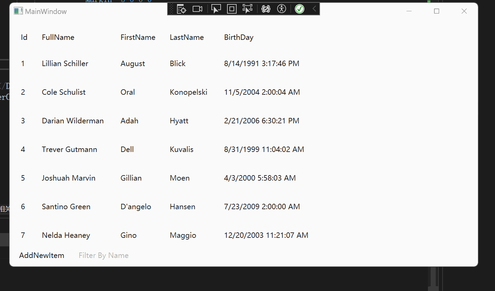
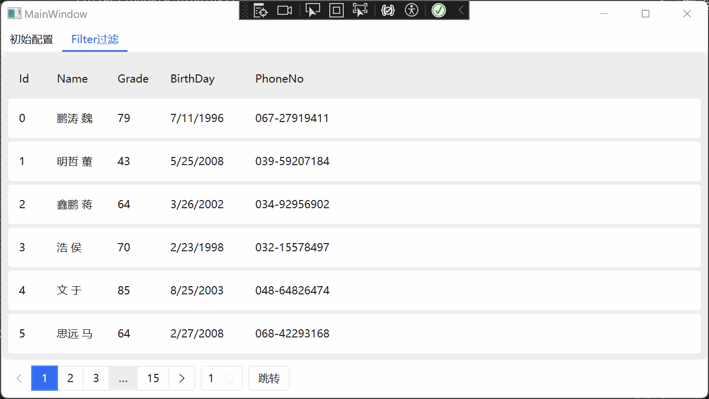

# 前言
为了更好的学习WPF的相关基础课程，我将B站【十月的寒流】对应的课程的代码写在这里。可能和原视频的代码有所出入。主要作为个人学习使用。

# 运行环境
- Visual Studio 2022
- .net core 8.0

# 十月的寒流
>[十月的寒流 B站主页](https://space.bilibili.com/600592/video)

# Wpf合集

|文件名|原视频地址|CSDN博客地址|
-|-|-
DataGrid_Filter|[在 WPF 中制作 DataGrid 的数据筛选功能](https://www.bilibili.com/video/BV1aP411u7wN/?spm_id_from=333.999.0.0&vd_source=17cf6a5a912b0a39a628030a5814462c)|[WPF 【十月的寒流】学习笔记(1):DataGrid过滤](https://blog.csdn.net/qq_44695769/article/details/136287235?csdn_share_tail=%7B%22type%22%3A%22blog%22%2C%22rType%22%3A%22article%22%2C%22rId%22%3A%22136287235%22%2C%22source%22%3A%22qq_44695769%22%7D)
WpfMvvmDemo|[MVVM实战技巧之：可被观测的集合（ObservableCollection & BindingLis](https://www.bilibili.com/video/BV16e4y1F7Vm/?spm_id_from=333.337.search-card.all.click&vd_source=17cf6a5a912b0a39a628030a5814462c)|[WPF 【十月的寒流】学习笔记(2):MVVM中是怎么实现通知的](https://blog.csdn.net/qq_44695769/article/details/136310245?csdn_share_tail=%7B%22type%22%3A%22blog%22%2C%22rType%22%3A%22article%22%2C%22rId%22%3A%22136310245%22%2C%22source%22%3A%22qq_44695769%22%7D)
DataGrid_Pagination|[WPF 中如何制作 DataGrid 的分页功能](https://www.bilibili.com/video/BV1T84y1t7Xc/?spm_id_from=333.999.0.0&vd_source=17cf6a5a912b0a39a628030a5814462c)|[WPF 【十月的寒流】学习笔记(3):DataGrid分页](https://blog.csdn.net/qq_44695769/article/details/136332652?csdn_share_tail=%7B%22type%22%3A%22blog%22%2C%22rType%22%3A%22article%22%2C%22rId%22%3A%22136332652%22%2C%22source%22%3A%22qq_44695769%22%7D)

# 基础知识补充

## CommunityToolkit.Mvvm

> [WPF CommunityToolkit.Mvvm](https://blog.csdn.net/qq_44695769/article/details/132350216?ops_request_misc=%257B%2522request%255Fid%2522%253A%2522170886624716800215017523%2522%252C%2522scm%2522%253A%252220140713.130102334.pc%255Fblog.%2522%257D&request_id=170886624716800215017523&biz_id=0&utm_medium=distribute.pc_search_result.none-task-blog-2~blog~first_rank_ecpm_v1~rank_v31_ecpm-1-132350216-null-null.nonecase&utm_term=CommunityToolkit.mvvm&spm=1018.2226.3001.4450)

> [WPF CommunityToolkit.Mvvm Messenger通讯](https://blog.csdn.net/qq_44695769/article/details/132649962?ops_request_misc=%257B%2522request%255Fid%2522%253A%2522170886624716800215017523%2522%252C%2522scm%2522%253A%252220140713.130102334.pc%255Fblog.%2522%257D&request_id=170886624716800215017523&biz_id=0&utm_medium=distribute.pc_search_result.none-task-blog-2~blog~first_rank_ecpm_v1~rank_v31_ecpm-2-132649962-null-null.nonecase&utm_term=CommunityToolkit.mvvm&spm=1018.2226.3001.4450)

## HandyControl

> [WPF-UI HandyControl 简单介绍](https://blog.csdn.net/qq_44695769/article/details/135002818?ops_request_misc=%257B%2522request%255Fid%2522%253A%2522170886629116800186553367%2522%252C%2522scm%2522%253A%252220140713.130102334.pc%255Fblog.%2522%257D&request_id=170886629116800186553367&biz_id=0&utm_medium=distribute.pc_search_result.none-task-blog-2~blog~first_rank_ecpm_v1~rank_v31_ecpm-3-135002818-null-null.nonecase&utm_term=handycontrol&spm=1018.2226.3001.4450)

> [WPF-UI HandyControl 控件简单实战+IconPacks矢量图导入](https://blog.csdn.net/qq_44695769/article/details/135012230?ops_request_misc=%257B%2522request%255Fid%2522%253A%2522170886629116800186553367%2522%252C%2522scm%2522%253A%252220140713.130102334.pc%255Fblog.%2522%257D&request_id=170886629116800186553367&biz_id=0&utm_medium=distribute.pc_search_result.none-task-blog-2~blog~first_rank_ecpm_v1~rank_v31_ecpm-1-135012230-null-null.nonecase&utm_term=handycontrol&spm=1018.2226.3001.4450)

# 实现效果
 
